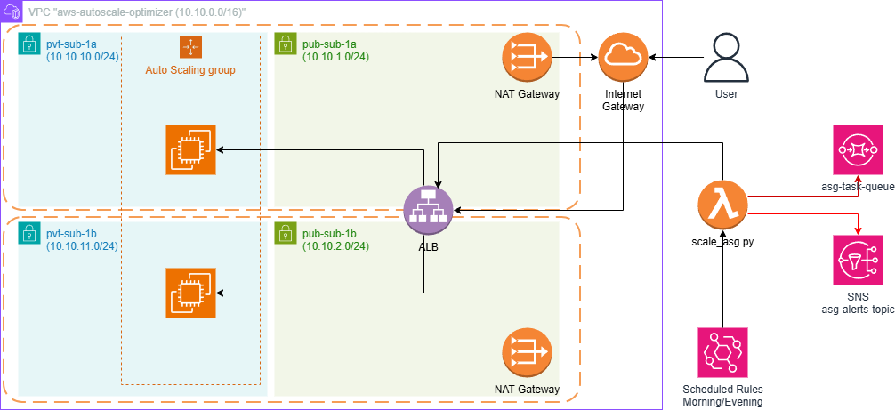

# AWS Auto-Scale Optimizer


A Python/Boto3 Infrastructure-as-Code (IaC) project that deploys, dynamically scales, and cleanly destroys a secure AWS web architecture using an event-driven automation model.

---

## Overview

This project extends traditional infrastructure provisioning by integrating EventBridge and Lambda to dynamically scale workloads based on predefined schedules.

Safety mechanisms included:
- Failed scaling events routed to SQS
- Administrative alerts sent via SNS

---

## Architecture

### Architecture Diagram


### High-Level Flow
User Traffic → ALB → Target Group → EC2 (ASG in Private Subnets)  
↑  
Lambda (Scaling Logic)  
↑  
EventBridge (Scheduled Triggers)  
↓  
SQS (Dead Letter Queue) ← Errors → SNS Alerts

---

## Architecture Breakdown

### Network Layer
- Multi-AZ VPC
- Public and Private Subnets
- Internet Gateway
- NAT Gateways

### Compute Layer
- Application Load Balancer
- Target Groups
- Launch Templates
- Auto Scaling Group in private subnets

### Automation Layer
- EventBridge (scheduled triggers)
- Lambda (scaling logic)
- SNS (notifications)
- SQS (dead-letter queue)

---

## Key Features

### Fault Tolerance and Chaos Testing
- Simulates IAM permission failures
- Validates error handling pipeline

Failure flow:
1. Lambda fails to scale ASG
2. Error is handled gracefully
3. Payload pushed to SQS
4. SNS notification sent

#### Trigger Chaos Test Example
```python
from automation.scale_asg import simulate_iam_failure
simulate_iam_failure()
```

### Idempotent Deployment
- Safe re-execution of scripts
- Prevents duplicate resource creation

### Configuration Management
- Centralized configuration via `config.yaml`
- Easily modify:
  - CIDR ranges
  - Instance types
  - Scaling schedules

#### Sample `config.yaml`
```yaml
aws_region: us-east-1
vpc_cidr: 10.0.0.0/16
instance_type: t3.medium
asg_min: 1
asg_max: 3
```

### Automated Teardown
- Clean resource deletion using `main_destroy.py`
- Handles dependencies such as:
  - Load balancer draining
  - Gateway detachment
- Prevents unnecessary AWS costs

---

## Getting Started

### Clone Repository
```bash
git clone https://github.com/gandhisiripuram/aws-autoscale-optimizer.git
cd aws-autoscale-optimizer
```

### Setup Environment
```bash
python3 -m venv venv
source venv/bin/activate
pip install -r requirements.txt
```

### Setup AWS Credentials
Ensure you have authenticated your local environment with AWS using the CLI or environment variables. This is required for the scripts to access AWS services:
```bash
aws configure
```
You can also set credentials via environment variables:
```bash
export AWS_ACCESS_KEY_ID=<your-access-key>
export AWS_SECRET_ACCESS_KEY=<your-secret-key>
export AWS_DEFAULT_REGION=us-east-1
```

### Configure
Edit `config.yaml` and set required values:
- AWS region
- CIDR ranges
- Scaling schedules

### Deploy
```bash
python main_deploy.py
```
After execution:
- ALB DNS will be printed
- Access application via browser

### Destroy
```bash
python main_destroy.py
```

---

## Design Decisions & Trade-offs
While declarative tools like Terraform are standard for IaC, I intentionally built this using Python and Boto3 to gain a deeper, low-level understanding of AWS API interactions, dependency graphing during teardown, and imperative state handling.

---

## Skills Demonstrated

### Infrastructure as Code
- AWS automation using Python and Boto3

### Event-Driven Systems
- Scheduled scaling using EventBridge and Lambda

### Resilience Engineering
- IAM least privilege enforcement
- SQS dead-letter queue and SNS alerting

### Engineering Practices
- Idempotent scripts
- Modular architecture
- Dependency-aware teardown

---