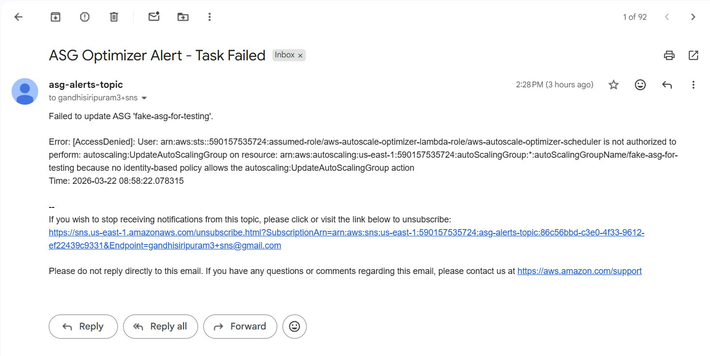
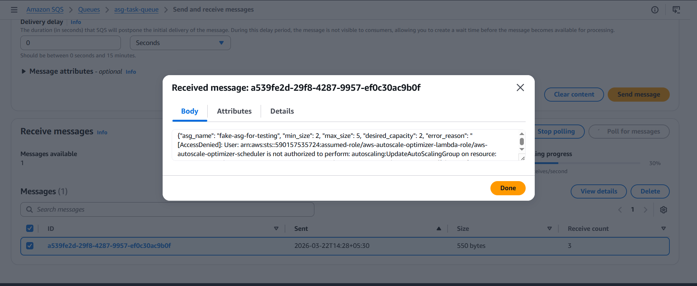

# AWS Auto-Scale Optimizer


A Python/Boto3 Infrastructure-as-Code (IaC) project that deploys, dynamically scales, and cleanly destroys a secure AWS web architecture using an event-driven automation model.

---

## Overview

This project provisions a secure, scalable AWS architecture using Python and Boto3. It implements a full **three-tier system**:

1. **Network Tier:** Multi-AZ VPC with public and private subnets, Internet Gateway, and NAT Gateways to provide a resilient, secure networking foundation.

2. **Compute Tier:** Auto Scaling Groups of EC2 instances behind an Application Load Balancer, enabling dynamic scaling based on traffic or schedules.

3. **Automation Tier:** Event-driven orchestration with EventBridge scheduling and Lambda functions for scaling logic. SQS dead-letter queues and SNS alerts ensure robust error handling and observability.

The system dynamically scales workloads while maintaining fault tolerance, with safety mechanisms to handle failures gracefully and alert administrators.

---

## Architecture

### Architecture Diagram


### High-Level Flow

User Traffic → ALB → Target Group → EC2 (ASG in Private Subnets)  
↑  
Lambda (Scaling Logic)  
↑  
EventBridge (Scheduled Triggers)  
↓  
SQS (Dead Letter Queue) ← Errors → SNS Alerts  

---
## Key Features

### Fault Tolerance & Chaos Testing
- Simulates IAM permission failures  
- Validates full error-handling pipeline  

**Failure flow:**
1. Lambda fails to scale ASG  
2. Error is handled gracefully  
3. Payload pushed to SQS  
4. SNS notification sent  

### How to Trigger Chaos Testing

**Objective:** Verify the "Safety Net" pipeline by forcing a failure and confirming it is handled through SNS + SQS.

**Trigger Mechanism:** Send a Lambda payload with `chaos_test: true`.

**Sample Payload:**
```json
{
  "asg_name": "aws-autoscale-optimizer-asg",
  "min_size": 1,
  "max_size": 2,
  "desired_capacity": 1,
  "chaos_test": true
}
```

**Expected Behavior:**
- Lambda catches the simulated `ClientError`  
- SNS sends an alert notification  
- Original payload pushed to SQS for recovery or analysis  

### Observed Validation

**SNS Alert:**  


**SQS Dead Letter Queue:**  


This confirms that the event-driven architecture handles failures gracefully across all tiers.

---
## Configuration Management

Centralized via `config.yaml` for:
- AWS region  
- CIDR ranges  
- Instance types  
- Scaling parameters  

**Sample `config.yaml`:**
```yaml
aws_region: us-east-1
vpc_cidr: 10.0.0.0/16
instance_type: t3.medium
asg_min: 1
asg_max: 3
```

---
## Demonstration

<details>
<summary><strong>Deployment Logs</strong></summary>

```text
[INFO] Starting AWS infrastructure deployment...
[INFO] VPC created successfully: vpc-0123456789abcdef0
[INFO] Subnets and Routing configured.
[INFO] ASG created and scaling to minimum capacity (1).
[SUCCESS] Deployment complete.
```
</details>

<details>
<summary><strong>Teardown Logs</strong></summary>

```text
[INFO] Initiating teardown sequence...
[INFO] Draining and deleting Target Groups...
[INFO] Auto Scaling Group deleted.
[INFO] VPC and associated networking components removed.
[SUCCESS] Teardown complete. No orphaned resources.
```
</details>

### Screenshots

**Architecture Diagram:**  


---
## Project Structure

```text
aws-autoscale-optimizer/
├── config.yaml
├── main_deploy.py
├── main_destroy.py
│
├── network/
│   ├── CreateNetwork.py
│   └── TearDownNetwork.py
│
├── compute/
│   ├── CreateCompute.py
│   └── TearDownCompute.py
│
├── automation/
│   ├── CreateLambdaEvent.py
│   ├── scale_asg.py
│   └── TearDownLambdaEvent.py
│
├── utils/
│   └── config_loader.py
└── screenshots/
    ├── deployment_logs.txt
    ├── teardown_logs.txt
    ├── sqs.png
    ├── sns.png
    └── architecture.png
```

---
## Getting Started

### Clone Repository
```bash
git clone https://github.com/gandhisiripuram/aws-autoscale-optimizer.git
cd aws-autoscale-optimizer
```

### Setup Environment
```bash
python3 -m venv venv
source venv/bin/activate
pip install -r requirements.txt
```

### Setup AWS Credentials

**Recommended:** Use the AWS CLI and IAM roles (avoid hardcoding keys)
```bash
aws configure
```

Or via environment variables (less recommended):
```bash
export AWS_ACCESS_KEY_ID=<your-access-key>
export AWS_SECRET_ACCESS_KEY=<your-secret-key>
export AWS_DEFAULT_REGION=us-east-1
```

### Configure
Edit `config.yaml` to set:
- AWS region  
- CIDR ranges  
- Scaling parameters  

### Deploy
```bash
python main_deploy.py
```

### Destroy
```bash
python main_destroy.py
```

---
## Design Decisions & Trade-offs

While Terraform is standard for IaC, this project uses Python + Boto3 to:
- Gain low-level control over AWS API interactions  
- Implement imperative state handling  
- Understand dependency graphing during teardown  
- Build deeper intuition for AWS service orchestration  

---
## Skills Demonstrated
- Infrastructure as Code with Python + Boto3  
- Event-driven scaling using EventBridge + Lambda  
- Resilience engineering via SQS + SNS  
- Idempotent and modular deployment/teardown scripts

---